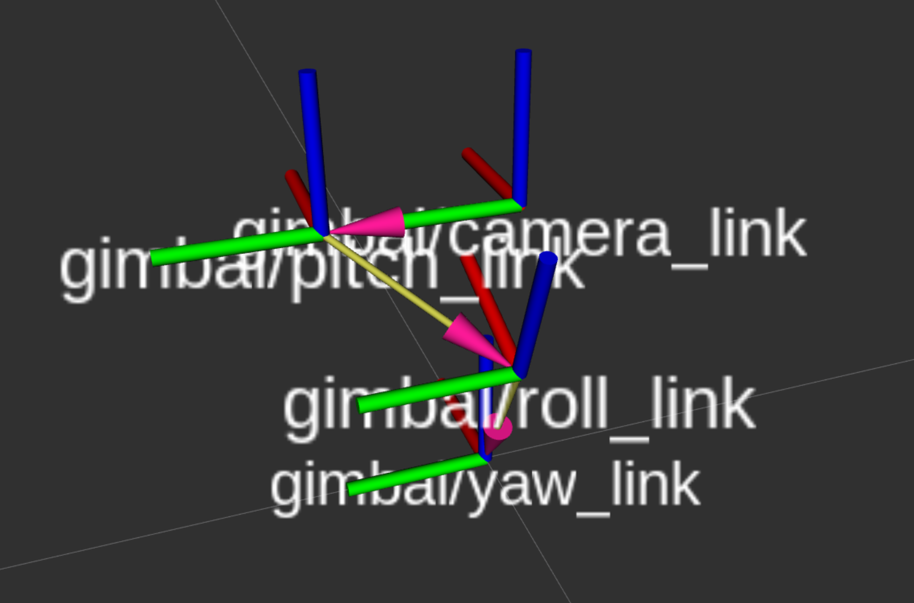

# z1_pro_driver
ROS2 driver for the XF Z-1 Pro 3-axis gimbal camera.

This repo contains two packages: `z1_pro_driver`, where all the source code for 
controlling the camera and it's gimbal live, and `z1_pro_msgs` where we have defined
a couple of messages for smooth operation of the system.

To run:
`ros2 launch z1_pro_driver z1_pro_launch.py namespace:=YOUR_VEHICLES_NAMESPACE tf_frame_prefix:=SOME_NICE_PREFIX camera_ip:=GUESSWHAT camera_port:=IWONDER use_vehicle_altitude:=true/false`

The command above launches 4 different nodes:
  - The `read_and_publish` script that serves as the low-level driver for control
  and feedback of the camera and gimbal.
  - The `gimbal_interface_node`, which is reponsible of providing a high-level interface
  for the user. It subscribes to the `gimbal_cam_cmd` topic, reads `CamCmd` messages,
    and does the necessary calculations to track the user-specified angles and/or
    point of interest (POI).
  - The `gimbal_joint_publisher` and a `robot_state_publisher`: these are responsible
  of reading the orientation feedback from the gimbal and bulding its corresponding
  TF tree using the camera's `robot_description` defined in its `urdf`.

The `CamCmd` message contains more information regarding the angle convention,
but in brief:
  - If `frame = BODY` -> roll, pitch, and yaw angles are defined as RPY angles
  in a conventional right-handed manner, with X (roll) pointing forwards, Y (pitch)
  pointing left, and Z (yaw) pointing up. See the image below.
  - (NOTE: hasn't been tested much) If `frame = GLOBAL` -> the interface will use the `odometry` information
  to orient the camera with respect to the World frame in NED. A raw `yaw` angle
  corresponds to compass heading! That is, 0-360 degrees with 0 poiting north and
  increasing towards East.

You can play with the gimbal from the terminal:
```
ros2 topic pub /M350/gimbal_camera/gimbal_cam_cmd z1_pro_msgs/msg/CamCmd "{
  frame: 0,
  roll: 0.0,
  pitch: -10.0,
  yaw: 90.0,
  poi: {},
  channel: 0,
  resolution: 0
}"
```

The dimensions for the `urdf` are shown in the drawings under the `fig` directory.




